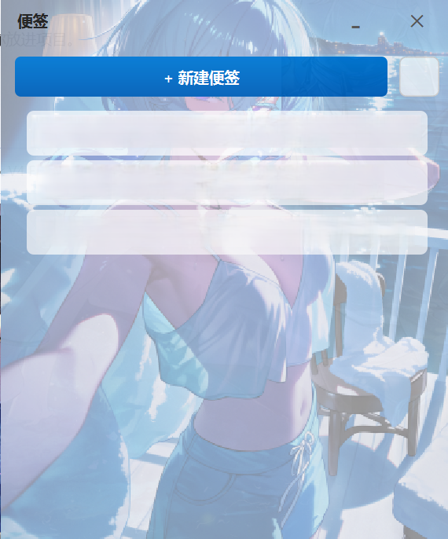
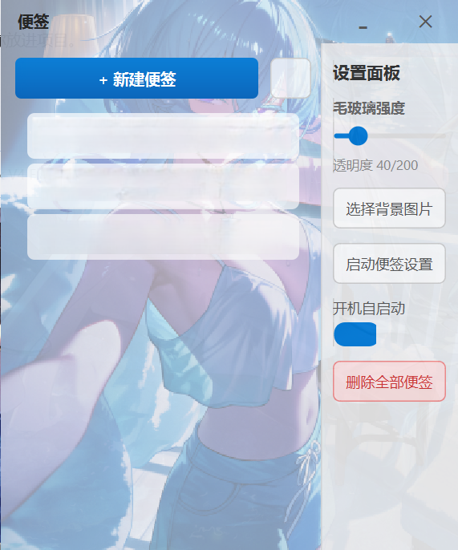
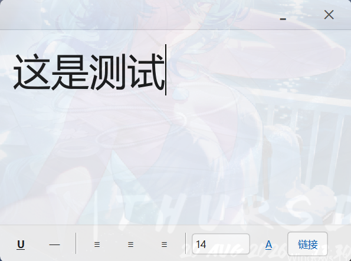

# StickyNotesQt

Windows 11 风格的桌面便签应用，基于 Qt 6 / C++17 开发。无边框窗口、托盘驻留、富文本便签、背景图同步，开箱即用。

## ✨ 功能特性

- 🪟 **Windows 11 原生风格**：无边框窗口、圆角、阴影、Fluent 按钮、现代配色
- 📌 **托盘驻留**：启动隐藏到系统托盘，不打扰桌面，后台常驻
- 📝 **富文本便签**：支持插入链接、右键跳转、样式编辑
- 🖼️ **背景图片同步**：设置背景图后实时同步到所有便签窗口
- 🗂️ **侧边栏面板**：设置项集中管理（背景、开机自启等）
- 🚀 **开机自启**：一键开启，随 Windows 启动
- 🔒 **单例防重复**：重复启动时聚焦已有实例，不会开多个进程
- 💾 **本地存储**：便签数据存于本地 JSON，轻量无依赖

## 🛠️ 技术栈

| 组件 | 版本/说明 |
|---|---|
| 语言 | C++17 |
| GUI 框架 | Qt 6.11.1 (MSVC 2022 x64) |
| 构建系统 | CMake + Visual Studio 17 2022 |
| 打包 | NSIS（installer.nsi）/ Inno Setup（installer/setup.iss） |

## 📸 截图







## 📖 使用说明

**新建便签**
点击主界面的 **+新建便签** 按钮，即可创建一张新便签。

**编辑便签**
便签支持富文本编辑：可输入文字、调整样式、插入链接；右键点击链接可跳转打开。

**设置面板**
点击主界面的设置按钮打开侧边栏设置面板，可以：

| 设置项 | 说明 |
|---|---|
| 毛玻璃强度 | 调节窗口毛玻璃效果强度 |
| 透明度 | 调节窗口透明度（40/200） |
| 选择背景图片 | 自定义便签背景图，实时同步到所有便签窗口 |
| 启动便签设置 | 控制是否随启动展开主界面 |
| 开机自启动 | 开启后随 Windows 开机自动运行 |

**托盘使用**
应用启动后驻留系统托盘，关闭窗口不会退出程序；再次启动应用会自动聚焦已有实例，不会重复打开多个进程。

**数据存储**
便签数据保存在本地 JSON 文件中，轻量、无外部依赖，卸载/移动程序不影响已有便签（数据在用户目录）。

## 🔧 环境要求

- Windows 10/11（64 位）
- Visual Studio 2022（含 C++ 桌面开发组件）
- Qt 6.11.1 MSVC 2022 64 位
- CMake ≥ 3.5

## 🚀 构建运行

项目内置一键构建脚本 `build.cmd`：

```bat
call "C:\Program Files\Microsoft Visual Studio\2022\Community\VC\Auxiliary\Build\vcvarsall.bat" x64
cmake -B build-msvc -G "Visual Studio 17 2022" -A x64
cmake --build build-msvc --config Release
cmake --build build-msvc --config Debug
```

手动操作（VS 内）：

1. 用 VS2022 打开 `CMakeLists.txt`
2. 选择 x64 + Release 配置
3. 构建并运行

也可以直接跑 `run.cmd` 快速启动。

## 📦 打包安装程序

- **NSIS**：运行 `installer.nsi`（需 NSIS 编译环境）
- **Inno Setup**：用 Inno Setup Compiler 打开 `installer/setup.iss` 编译
- 产物：`StickyNotesQt_Setup.exe`（安装程序）

## 📁 项目结构

```
├── src/                    源码
│   ├── main.cpp            程序入口
│   ├── note_data.*         便签数据结构与 JSON 序列化
│   ├── note_data_manager.* 便签数据管理（增删改查、本地存储）
│   ├── note_manager.*      便签主界面/列表管理
│   ├── note_list_widget.*  便签列表 UI 组件
│   ├── note_widget.*       单个便签 UI 组件
│   ├── custom_title_bar.*  自定义无边框标题栏
│   ├── rich_text_toolbar.* 富文本编辑工具栏
│   ├── rich_text_actions.* 富文本操作（链接插入/跳转等）
│   ├── settings_dialog.*   设置对话框（背景、开机自启等）
│   └── win11_style.*       Win11 风格（圆角、阴影、Fluent 按钮）
├── resources/              资源（图标等）
├── CMakeLists.txt          CMake 构建配置
├── build.cmd               一键构建脚本
├── run.cmd                 快速启动脚本
├── installer.nsi           NSIS 打包脚本
└── installer/setup.iss     Inno Setup 打包脚本
```

## 📄 许可证

[MIT License](LICENSE)
